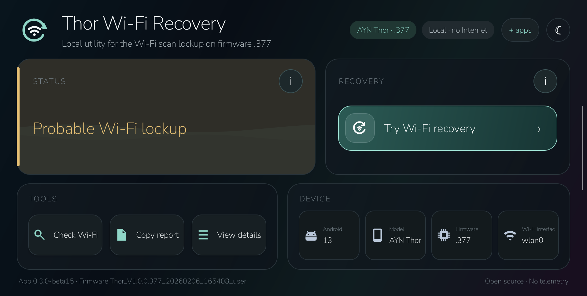
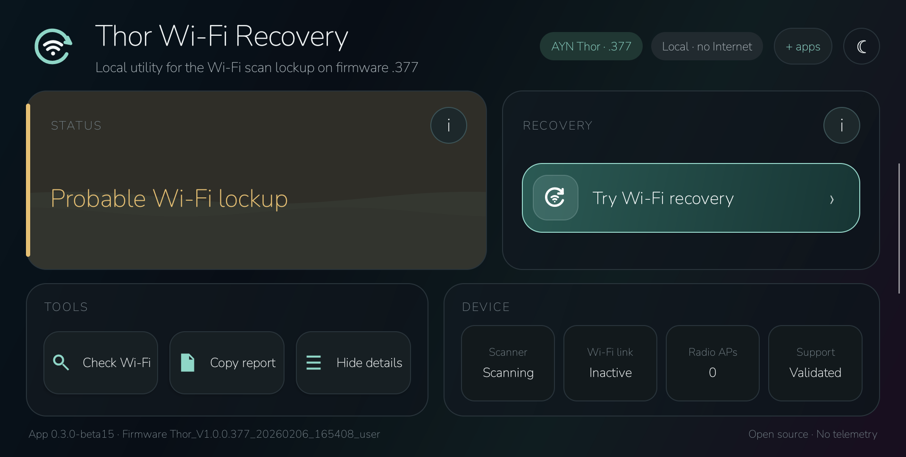
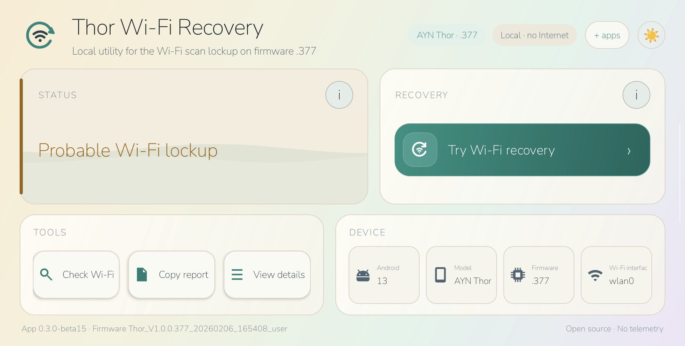
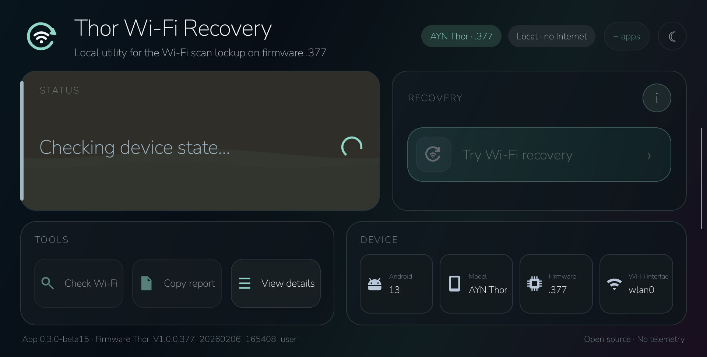

# AYN Thor Wi-Fi Recovery

[](https://github.com/JoelMomo/AYN-Thor-WiFi-Recovery/actions/workflows/android-ci.yml)

Open-source Android recovery tool for the intermittent Wi-Fi scan lockup observed on the stock **AYN Thor** firmware `.377`.

<p align="center">
  
</p>

> [!IMPORTANT]
> This is an experimental community workaround, not an official AYN fix. It does not modify the firmware, but recovery restarts Android services and closes running apps. Save your game first.

## Validated configuration

- **Device:** AYN Thor
- **Android:** 13
- **Firmware:** `Thor_V1.0.0.377_20260206_165408_user`
- **Observed symptom:** Wi-Fi is enabled, but scanning becomes stuck and Android stops showing nearby access points.

The app deliberately fails closed on unvalidated firmware.

## Android app

Current development build on `main`: **0.3.0-beta15**

Latest signed public prerelease: **0.3.0-beta11**

[Download the latest signed prerelease](https://github.com/JoelMomo/AYN-Thor-WiFi-Recovery/releases)

The app:

- checks the exact validated firmware before recovery can be enabled;
- reads Android's Wi-Fi scanner state without starting another framework scan;
- distinguishes healthy, confirmed, probable, timeout, error and unsupported states;
- uses low-level radio evidence only when needed;
- chooses between a framework-only recovery and a deeper Wi-Fi HAL + framework recovery;
- verifies the scanner after Android returns and can escalate once if the light recovery did not clear the lockup;
- copies a sanitized local support report;
- requests **no Internet permission** and contains **no telemetry**;
- does not read or store Wi-Fi passwords.

## How recovery works

The affected `.377` unit was observed with `WifiSingleScanStateMachine` stuck in `ScanningState`.

Thor Wi-Fi Recovery uses two recovery levels:

1. **Framework recovery** — restarts Android's runtime/framework when the lower Wi-Fi path still appears alive.
2. **Deep recovery** — restarts `vendor.wifi_hal_legacy` and then Android's framework when there is no carrier and no low-level AP evidence.

After recovery, the app waits for Android to settle, checks the scanner again, retries once, and can escalate from the light path to the deep path if necessary.

The original manual fallback remains available as `Thor_WiFi_Recovery.sh`.

## Screenshots

<p align="center">
  
  
</p>

<p align="center">
  
</p>

Screenshots are captured directly from the physical Thor. System status/navigation bars have been removed from the documentation images.

## Languages

The UI follows Android's system language or Android 13's per-app language setting.

- English
- Español
- Català
- Galego
- Euskara
- Português
- Deutsch
- Français
- Italiano
- Русский
- 日本語
- 简体中文

Spanish uses the generic `es` resource set, so Android variants such as `es-419` also remain in Spanish rather than falling back to English. The current wording is the same Spanish translation used for Spain.

All twelve translations are checked against the same translatable resource set. CI rejects missing/extra localized resources, and the current development build is visually validated on the physical Thor in **dark and light themes** for every included language.

## Installation

1. Download the signed APK from [GitHub Releases](https://github.com/JoelMomo/AYN-Thor-WiFi-Recovery/releases).
2. Install and open **Thor Wi-Fi Recovery**.
3. When the Wi-Fi network list is empty, tap **Check Wi-Fi**.
4. **Recover Wi-Fi** is enabled only when the app has enough evidence to permit the validated recovery path.
5. Save any open game/app before starting recovery.
6. Use **Copy report** if you need to share a sanitized diagnostic result.

If you previously installed one of the old debug APKs, uninstall it once before installing the signed release because the signing key is different.

## More apps

The compact **+ apps** control in the app header opens JoelMomo's GitHub repository list in the system browser. This keeps the Wi-Fi utility independent while providing a future-proof route to other projects, including **CarePad** and any later apps such as the planned keyboard.

- [CarePad](https://github.com/JoelMomo/CarePad)
- [More projects by JoelMomo](https://github.com/JoelMomo?tab=repositories)

Opening these links is delegated to the browser; Thor Wi-Fi Recovery still requests no Internet permission itself.

### Release signing certificate

SHA-256:

`0d901b01a4230283554200ce674999a89bfe16c00388d95d288e4e2ba5933b59`

## When not to use it

This tool is for the specific scan-lockup pattern above. It is not intended to fix:

- wrong Wi-Fi passwords;
- authentication failures;
- DHCP/IP problems;
- router Internet outages;
- ordinary "connected without Internet" issues.

## Privacy and safety

- No `android.permission.INTERNET`.
- No telemetry or analytics.
- No SSID/BSSID/password collection in the support report.
- Recovery is restricted to the exact validated firmware.
- Saved networks, ROMs, emulator data and frontend configuration are not erased.
- Recovery does close running Android apps because framework services are restarted.

## Manual script fallback

The repository still includes `Thor_WiFi_Recovery.sh`.

1. Copy it to the Thor, for example to `Download`.
2. Save all open progress.
3. Open the AYN/Thor settings app.
4. Open **Run script as Root**.
5. Select the script.

The manual script runs:

```sh
setprop ctl.restart zygote
```

and writes a small timestamp log to:

`/sdcard/Download/ayn_thor_wifi_recovery.log`

The Android app is preferred because it adds firmware gating, diagnosis, adaptive recovery and post-recovery verification.

## Development and CI

GitHub Actions runs on pushes to `main` and pull requests. CI uses JDK 17 and runs:

- unit tests;
- Android lint;
- APK compilation;
- translation-resource parity for every locale declared in `locales_config.xml`;
- a built-APK check that rejects `android.permission.INTERNET`;
- source checks against obvious logging of SSIDs, BSSIDs, `WifiInfo` or passwords;
- debug APK and lint-report artifact upload.

Public release APKs are signed locally with a dedicated release key. The private signing key is not stored in GitHub.

For implementation details, validation evidence and known limitations, see [TECHNICAL_NOTES.md](TECHNICAL_NOTES.md).

Third-party notices, including the Nunito font license and the upstream Binder-reference attribution, are in [THIRD_PARTY_NOTICES.md](THIRD_PARTY_NOTICES.md).

## License

MIT. See [LICENSE](LICENSE).
