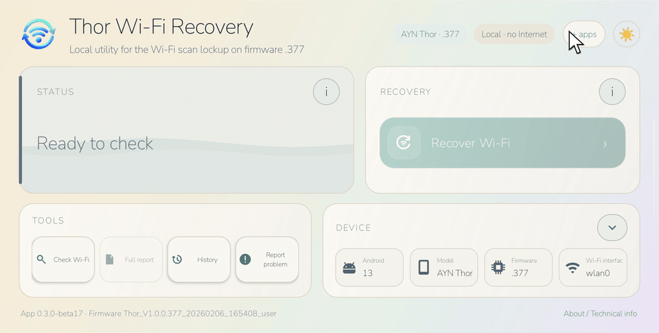
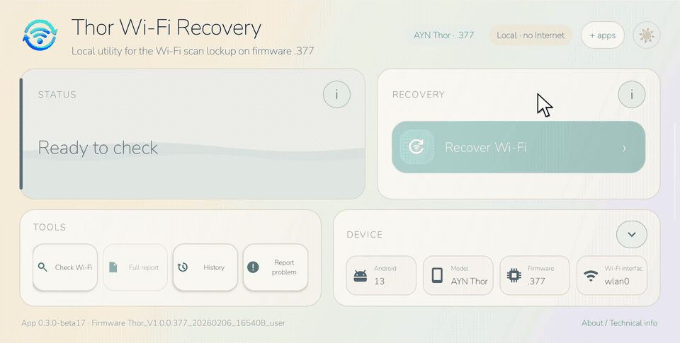
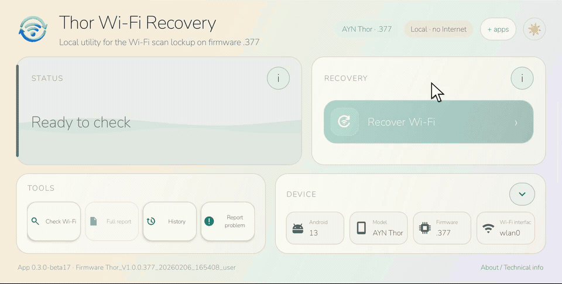
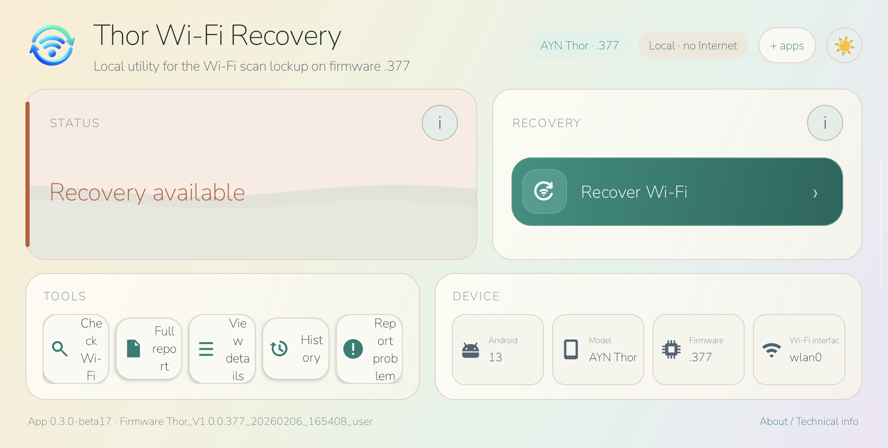
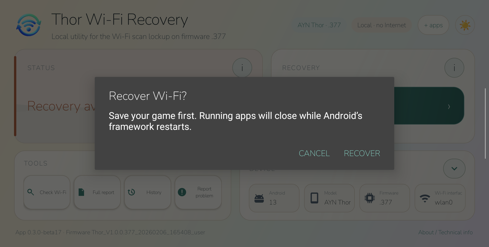
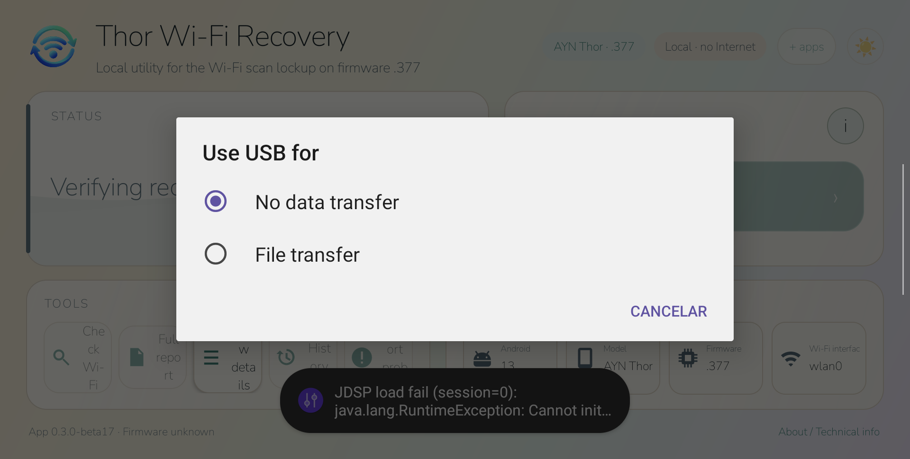
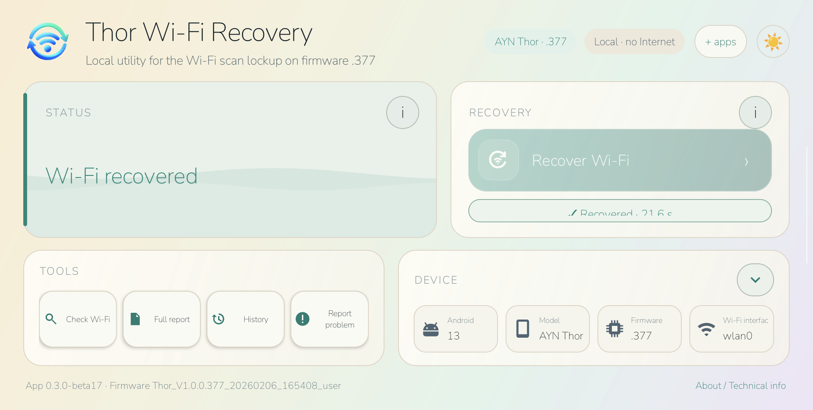

# AYN Thor Wi-Fi Recovery

[](https://github.com/JoelMomo/AYN-Thor-WiFi-Recovery/actions/workflows/android-ci.yml) [](https://github.com/JoelMomo/AYN-Thor-WiFi-Recovery/releases) [](https://joelmomo.github.io/)

Open-source Android recovery tool for the intermittent Wi-Fi scan lockup observed on the stock **AYN Thor** firmware `.377`.

<p align="center">
  
</p>

<p align="center">
  <sub>Ready to check on the physical AYN Thor · English UI · system bars cropped.</sub>
</p>

> [!IMPORTANT]
> This is an experimental community workaround, not an official AYN fix. It does not modify the firmware, but recovery restarts Android services and closes running apps. Save your game first.

## Validated configuration

- **Device:** AYN Thor
- **Android:** 13
- **Firmware:** `Thor_V1.0.0.377_20260206_165408_user`
- **Observed symptom:** Wi-Fi is enabled, but scanning becomes stuck and Android stops showing nearby access points.

The app deliberately fails closed on unvalidated firmware.

## Android app

Current app version on `main`: **0.3.0-beta17** (with post-release maintenance commits)

Latest signed public prerelease: **0.3.0-beta17**

[Download the latest signed prerelease](https://github.com/JoelMomo/AYN-Thor-WiFi-Recovery/releases)

The app:

- checks the exact validated firmware before recovery can be enabled;
- reads Android's Wi-Fi scanner state without starting another framework scan;
- distinguishes healthy, confirmed, probable, timeout, error and unsupported states;
- uses low-level radio evidence only when needed;
- chooses between a framework-only recovery and a deeper Wi-Fi stack + framework recovery;
- verifies the scanner after Android returns and can escalate once if the light recovery did not clear the lockup;
- copies a full sanitized technical report with app/device/diagnostic state and recent local history;
- keeps a local history of the latest 10 checks/recoveries without network identifiers;
- can open a prefilled GitHub problem report in the system browser without adding Internet permission;
- shows a clear post-recovery result with outcome and elapsed time;
- includes an **About / Technical info** page with version, validated firmware, recovery strategy and privacy details;
- requests **no Internet permission** and contains **no telemetry**;
- does not read or store Wi-Fi passwords.

### Light / dark mode

<p align="center">
  
</p>

<p align="center">
  <sub>Theme switching on the physical Thor. The pointer and click rings show the exact UI interaction.</sub>
</p>

## How recovery works

The affected `.377` unit was observed with `WifiSingleScanStateMachine` stuck in `ScanningState`.

Thor Wi-Fi Recovery uses two recovery levels:

1. **Framework recovery** — restarts Android's runtime/framework when the lower Wi-Fi path still appears alive.
2. **Deep recovery** — disables Wi-Fi, restarts `vendor.wifi_hal_legacy`, `wificond` and `wpa_supplicant`, re-enables Wi-Fi, lets the stack settle, then restarts Android's framework.

After recovery, the app waits for Android to settle, checks the scanner again, retries once, and can escalate from the light path to the deep path if necessary.

The original manual fallback remains available as `Thor_WiFi_Recovery.sh`.

## Recovery flow on a physical Thor

For documentation, the scanner fault below was deliberately reproduced on the physical AYN Thor running the validated `.377` firmware by holding the Wi-Fi scanner in a persistent `ScanningState`. This triggers the same diagnosis and recovery path the app uses when the intermittent firmware lockup occurs naturally.

<p align="center">
  
</p>

<p align="center">
  <sub>Real recovery on the physical Thor. Restarting Android's framework necessarily stops Android's own screen recorder, so the GIF smoothly rejoins at the verification/result state; every state shown comes from the physical device.</sub>
</p>

<p align="center">
  
  
</p>

<p align="center">
  
  
</p>

1. **Detect** - `Check Wi-Fi` sees that the scanner remains in `ScanningState` instead of returning to `IdleState`, and enables recovery.
2. **Confirm** - `Recover Wi-Fi` warns that running apps will close because Android's framework is about to restart.
3. **Recover and verify** - after the restart, the pending recovery state is preserved. When the activity is recreated, the app waits for Android and Wi-Fi to settle and checks the scanner again.
4. **Result** - if the scanner returns to `IdleState`, the app reports **Wi-Fi recovered**. If the lighter framework restart does not clear the lockup, beta17 can escalate to the deeper Wi-Fi stack recovery automatically.

The elapsed time shown in the result is measured on-device and can vary with Android restart and reconnection time.

## Screenshots

<p align="center">
  
  
</p>

<p align="center">
  
</p>

Screenshots are captured directly from the physical Thor. System status/navigation bars have been removed from the documentation images.

## Languages

The UI follows Android's system language or Android 13's per-app language setting.

- English
- Español
- Català
- Galego
- Euskara
- Português
- Deutsch
- Français
- Italiano
- Русский
- 日本語
- 简体中文

Spanish uses the generic `es` resource set, so Android variants such as `es-419` also remain in Spanish rather than falling back to English. The current wording is the same Spanish translation used for Spain.

All twelve translations are checked against the same translatable resource set, and CI rejects missing/extra localized resources plus reversible UTF-8 mojibake. The beta17 tool layout was physically validated on the Thor across **all twelve locales**, including real line-break checks for every localized tool label so words are not split or ellipsized. The English dark/light documentation screenshots were also refreshed from the physical device.

## Installation

1. Download the signed APK from [GitHub Releases](https://github.com/JoelMomo/AYN-Thor-WiFi-Recovery/releases).
2. Install and open **Thor Wi-Fi Recovery**.
3. When the Wi-Fi network list is empty, tap **Check Wi-Fi**.
4. **Recover Wi-Fi** is enabled only when the app has enough evidence to permit the validated recovery path.
5. Save any open game/app before starting recovery.
6. Use **Full report** to copy the sanitized technical report, **History** for the latest local checks/recoveries, or **Report problem** to open a prefilled GitHub issue.

If you previously installed one of the old debug APKs, uninstall it once before installing the signed release because the signing key is different.

## More apps

The compact **+ apps** control in the app header opens the dedicated [JoelMomo apps landing page](https://joelmomo.github.io/) in the system browser. The landing keeps project discovery separate from this repository and reads public GitHub Releases directly, so availability and the small release log update automatically.

It currently covers:

- [Thor Wi-Fi Recovery](https://github.com/JoelMomo/AYN-Thor-WiFi-Recovery)
- [CarePad](https://github.com/JoelMomo/CarePad)
- [RuneBoard](https://github.com/JoelMomo/RuneBoard)

Opening the landing is delegated to the browser; Thor Wi-Fi Recovery still requests no Internet permission itself.

### Release signing certificate

SHA-256:

`0d901b01a4230283554200ce674999a89bfe16c00388d95d288e4e2ba5933b59`

## When not to use it

This tool is for the specific scan-lockup pattern above. It is not intended to fix:

- wrong Wi-Fi passwords;
- authentication failures;
- DHCP/IP problems;
- router Internet outages;
- ordinary "connected without Internet" issues.

## Privacy and safety

- No `android.permission.INTERNET`.
- No telemetry or analytics.
- No SSID/BSSID/password collection in the support report.
- Recovery is restricted to the exact validated firmware.
- Saved networks, ROMs, emulator data and frontend configuration are not erased.
- Recovery does close running Android apps because framework services are restarted.

## Manual script fallback

The repository still includes `Thor_WiFi_Recovery.sh`.

1. Copy it to the Thor, for example to `Download`.
2. Save all open progress.
3. Open the AYN/Thor settings app.
4. Open **Run script as Root**.
5. Select the script.

The manual script runs:

```sh
setprop ctl.restart zygote
```

and writes a small timestamp log to:

`/sdcard/Download/ayn_thor_wifi_recovery.log`

The Android app is preferred because it adds firmware gating, diagnosis, adaptive recovery and post-recovery verification.

## Development and CI

GitHub Actions runs on pushes to `main` and pull requests. CI uses JDK 17 and runs:

- unit tests;
- Android lint;
- APK compilation;
- translation-resource parity for every locale declared in `locales_config.xml`, plus a UTF-8 mojibake guard;
- a built-APK check that rejects `android.permission.INTERNET`;
- source checks against obvious logging of SSIDs, BSSIDs, `WifiInfo` or passwords;
- debug APK and lint-report artifact upload.

A separate **Signed release** workflow can build, verify and hash signed APKs. Manual workflow runs produce a SHA-suffixed **snapshot artifact** and never publish a GitHub Release; pushing a matching `v*` tag publishes the signed APK and checksum automatically. It requires the repository secrets `ANDROID_KEYSTORE_BASE64`, `ANDROID_KEYSTORE_PASSWORD`, `ANDROID_KEY_ALIAS` and `ANDROID_KEY_PASSWORD`; the signing material is never committed to the repository. Tagged prereleases are marked automatically when the version contains a suffix such as `-beta17`.

For implementation details, validation evidence and known limitations, see [TECHNICAL_NOTES.md](TECHNICAL_NOTES.md).

Third-party notices, including the Nunito font license and the upstream Binder-reference attribution, are in [THIRD_PARTY_NOTICES.md](THIRD_PARTY_NOTICES.md).

## License

MIT. See [LICENSE](LICENSE).

## Contributing

Bug reports, feature ideas and focused pull requests are welcome. See [CONTRIBUTING.md](CONTRIBUTING.md) before opening one.

For security or privacy-sensitive reports, follow [SECURITY.md](SECURITY.md) instead of posting details publicly.

<div align="center">

## Support development

These projects are free to use and developed in my spare time. If they've been useful to you, you can help support future development.

<p>
  <a href="https://github.com/sponsors/JoelMomo">
    
  </a>
  <a href="https://ko-fi.com/joelmomodev">
    
  </a>
</p>

<sub>All projects remain free regardless of support.</sub>

</div>
